<div align="left">
  
</div>

## LimiX-2: A Large Foundation Model for Structured Data (LDM)
[](https://www.limix.ai/)
[](https://github.com/limix-ldm/LimiX/)
[](https://huggingface.co/stable-ai/)
[](https://modelscope.cn/organization/stable-ai/)
[](./LICENSE.txt)

<div align="center" style="line-height: 1;">
  <a href="README_cn.md" target="_blank">中文</a>
  &nbsp;|
  English
  &nbsp;
</div>

<br/>

## 🚀 News

- **[16 Sept 2026] 🚀 LimiX-2 open-source release.** The LimiX-2 weights ([`LimiX-2.ckpt`](https://huggingface.co/stable-ai/LimiX-2/tree/main)) and inference code are released with this repository. A single pretrained model performs classification, regression and missing-value imputation in one forward pass, without task-specific parameter updates. Usage is subject to [StableAI LimiX Non-Commercial License](https://huggingface.co/stableai-org/LimiX-2/blob/main/LICENSE). The LimiX-2 technical report is released as well, see [LimiX_2_Technical_Report.pdf](./LimiX_2_Technical_Report.pdf).
- **[4 June 2026] 🧠 Follow-up LimiX research accepted by ICML!**
  Paper: [LimiX-2M](https://arxiv.org/abs/2606.04485). This work extends the original [LimiX](https://arxiv.org/abs/2509.03505) structured-data foundation model. 
- **[10 Nov 2025] 🚀 LimiX-2M lightweight model officially released!**
  Compared with LimiX-16M, this lightweight model substantially reduces GPU memory usage and improves inference speed; the retrieval mechanism is also optimized, further improving model quality while reducing inference time and memory overhead.
- **[3 Sept 2025] 🧠 The LimiX paper is available on arXiv.**
  Paper: [arXiv:2509.03505](https://arxiv.org/abs/2509.03505). LimiX is the first structured-data large model for generalist intelligence, and the project is open-sourced under the Apache 2.0 license.
- **[29 Aug 2025] 🚀 LimiX V1.0 officially released.**
  The first stable official release of the LimiX structured-data foundation model.


## ✨ Introduction
LimiX-2 is the new-generation model of the LimiX family, developed through model and data scaling guided by our previously established scaling laws. LimiX-2 adopts the contextual mechanism network (CMN) paradigm and is pretrained with context-conditional masked modeling (CCMM). CMN shifts the organizing principle of in-context learning from target-centric prediction to mechanism-oriented joint modeling. Rather than centering the network on the `p(y | x, D_context)` objective of conventional tabular PFNs (prior-fitted networks), it is designed to learn `p(x, y | D_context)`, a context-dependent representation of the joint structure underlying data generation. Pretraining uses synthetic datasets generated by structural causal models (SCMs) spanning diverse graph structures, functional mechanisms, and observation processes. Evaluations on TabArena, TALENT, and BCCO show that LimiX-2 outperforms existing dataset-specific models and tabular foundation models. Beyond predictive performance, the CMN paradigm also endows LimiX-2 with causal awareness: its feature attention encodes direct causal relationships, enabling accurate recovery of the causal skeleton.

<div align="center">
  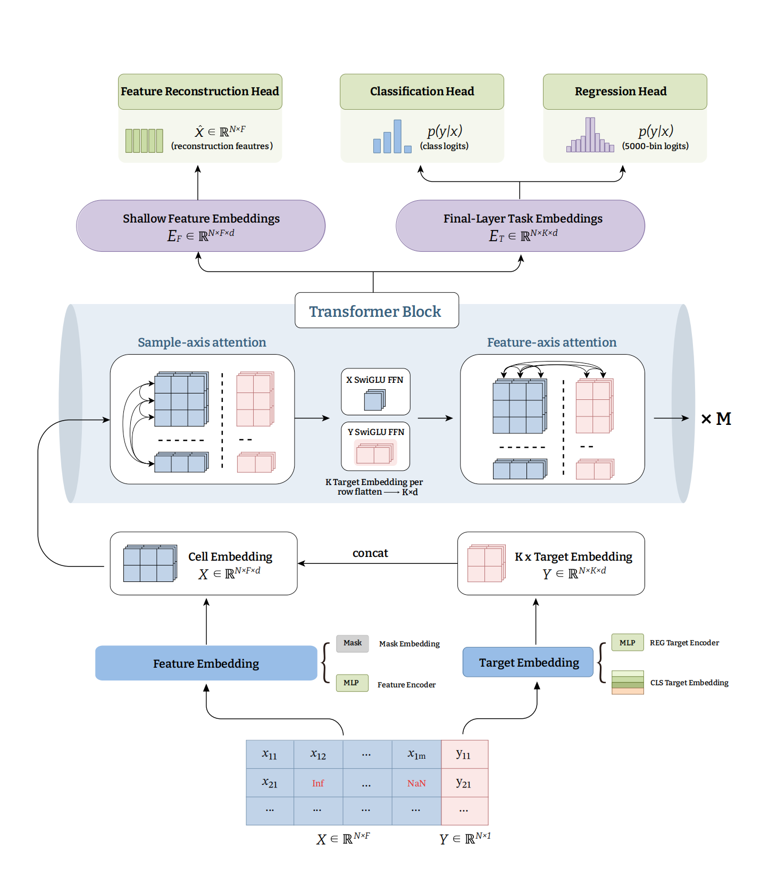
  <br>
  <sub>Overall structure of LimiX-2. </sub>
</div>

<div align="center">
  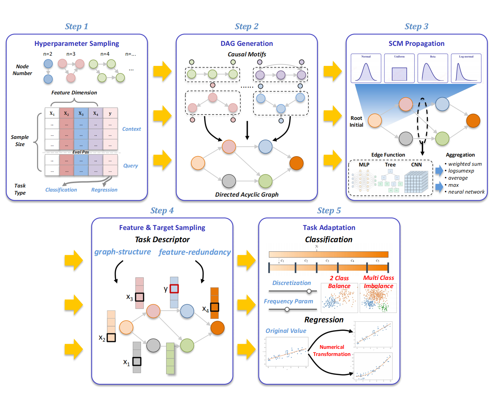
  <br>
  <sub>Synthetic data generation pipeline for pretraining.</sub>
</div>

### ➤ Available Models

<div align="center">

| Model | Parameters | Release date | Download link | Tasks supported |
| ----------- | ------------ | ------------ | ----------------------------------------------------------------------------- | ------------------------------------------------------ |
| LimiX-2 | 400M | 16 Sept 2026 | [LimiX-2.ckpt](https://huggingface.co/stable-ai/LimiX-2/tree/main) | ✅ cls ✅ reg ✅ imputation |
| LimiX-1_2M | 2M | 10 Nov 2025 | [LimiX-1_2M.ckpt](https://huggingface.co/stable-ai/LimiX-1_2M/tree/main) | ✅ cls ✅ reg ✅ imputation |
| LimiX-1_16M | 16M | 29 Aug 2025 | [LimiX-1_16M.ckpt](https://huggingface.co/stable-ai/LimiX-1_16M/tree/main) | ✅ cls ✅ reg ✅ imputation |

</div>

## 📈 Benchmark Results

### ➩ Overall Elo

LimiX-2 achieves the highest Elo rating on all three benchmarks, outperforming all compared foundation models and AutoGluon 1.6.

<div align="center">
  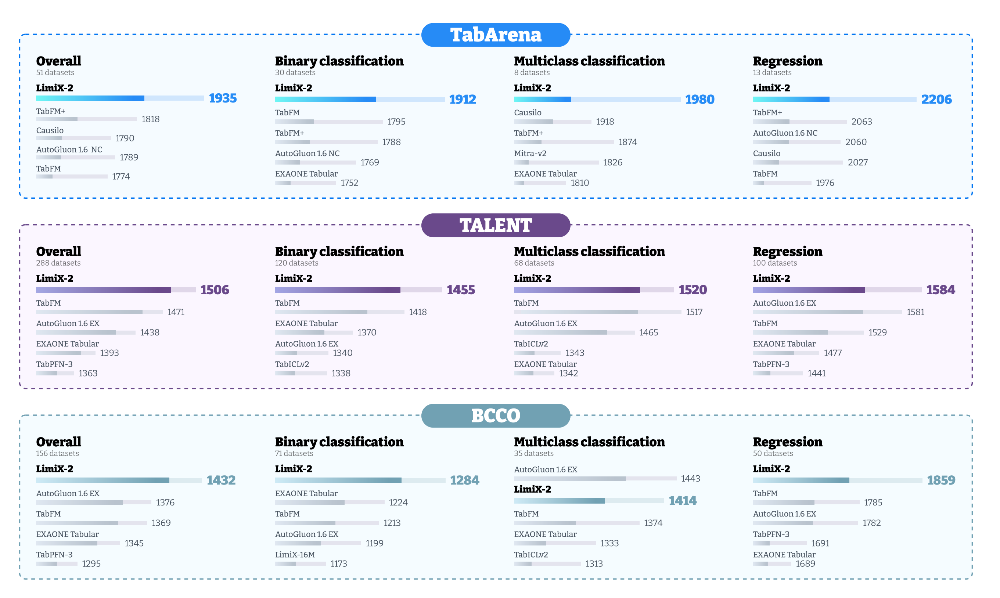
  <br>
  <sub>Performance overview on evaluated benchmarks.</sub>
</div>

### ➩ TabArena

On the full TabArena benchmark, LimiX-2 ranks first across all four predictive metrics, attaining an Elo of **1935** (117.4 points above the runner-up TabFM+ before rounding), an improvability of **3.3%**, an average rank of **5.5**, and an aggregated win count of **18.9** (≈3.6× TabFM+).

<div align="center">

| Model | Elo ↑ | Improv. ↓ | Rank ↓ | Wins ↑ |
| --- | --- | --- | --- | --- |
| **LimiX-2 (D)** | **1935** | **3.3%** | **5.5** | **18.9** |
| TabFM+ | 1818 | 6.2% | 9.0 | 5.3 |
| Causilo (D) | 1790 | 8.9% | 10.1 | 1.7 |
| AutoGluon 1.6 (NC, 4h) | 1789 | 8.6% | 10.1 | 1.2 |
| TabFM (D) | 1774 | 6.5% | 10.7 | 5.9 |
| Mitra-v2 (D) | 1769 | 8.3% | 10.9 | 3.2 |
| EXAONE Tabular (D) | 1749 | 9.5% | 11.8 | 2.9 |
| AutoGluon 1.6 (EX, 4h) | 1738 | 9.2% | 12.3 | 1.2 |
| AutoGluon 1.5 (EX, 4h) | 1648 | 10.2% | 16.9 | 1.3 |
| TabPFN-3 (D) | 1632 | 11.6% | 17.9 | 0.4 |

</div>

LimiX-2 also ranks first on both the classification (38 datasets, Table 3) and regression (13 datasets, Table 4) subsets:

<div align="center">

| Split | Elo ↑ | Improv. ↓ | Rank ↓ | Wins ↑ | Win Rate ↑ |
| --- | --- | --- | --- | --- | --- |
| Classification | **1917** | **4.3%** | **6.0** | **10.6** | **94.5%** |
| Regression | **2206** | **0.6%** | **3.8** | **8.3** | **96.9%** |

</div>

<div align="center">
  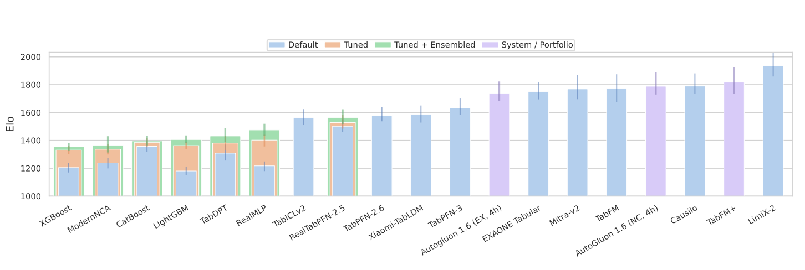
  <br>
  <sub>Performance on the TabArena benchmark. Baseline results cover default, tuned, and tuned-plus-ensembled configurations; LimiX-2 under the default configuration attains an Elo of 1935, outperforming all compared foundation models and AutoGluon under its noncommercial 4h configuration.</sub>
</div>

<div align="center">
  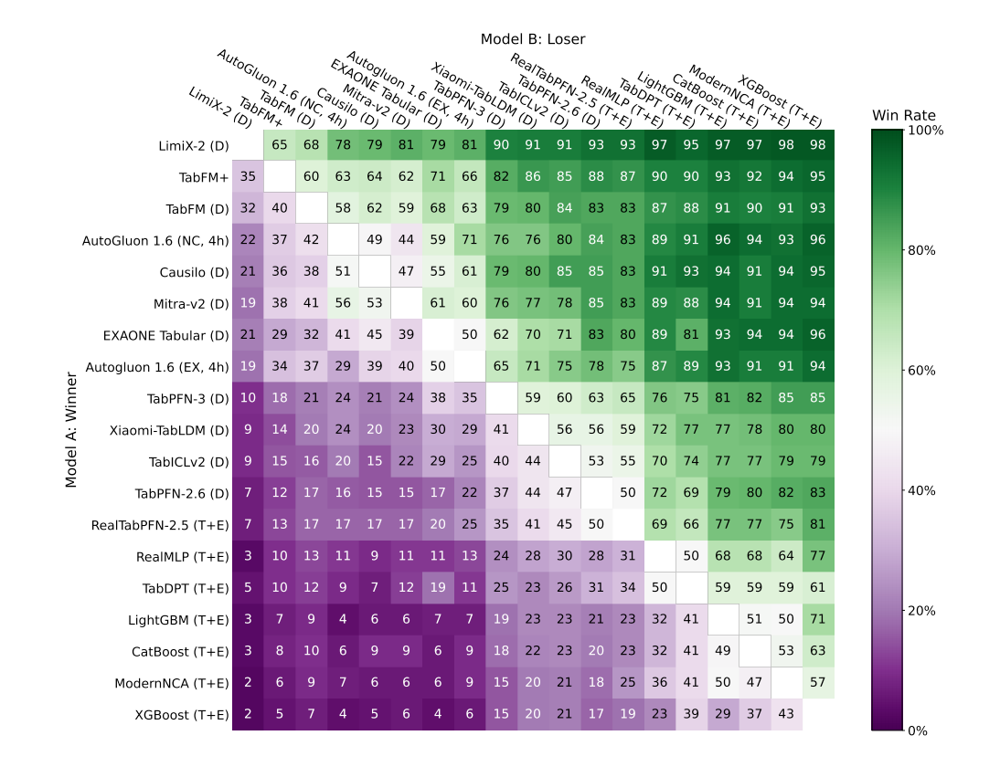
  <br>
  <sub>Pairwise win rates on the TabArena benchmark.</sub>
</div>

### ➩ TALENT

On TALENT, LimiX-2 achieves the highest Elo across all five evaluation categories, with an overall Elo of **1506** (35 points above TabFM), an improvability of **6.75%**, and an aggregated win count of **84.3** (≈1.7× TabFM).

<div align="center">

| Model | Elo | CLS | REG | Binary | Multi | Improv. ↓ | Wins ↑ |
| --- | --- | --- | --- | --- | --- | --- | --- |
| **LimiX-2** | **1506** | **1475** | **1584** | **1455** | **1520** | **6.75%** | **84.3** |
| TabFM | 1471 | 1449 | 1529 | 1418 | 1517 | 9.17% | 50.1 |
| AutoGluon 1.6 | 1438 | 1379 | 1581 | 1340 | 1465 | 11.21% | 48.0 |
| EXAONE Tabular | 1393 | 1358 | 1477 | 1370 | 1342 | 14.74% | 12.9 |
| TabPFN-3 | 1363 | 1331 | 1441 | 1333 | 1331 | 15.98% | 15.7 |
| LimiX-16M | 1227 | 1210 | 1268 | 1217 | 1198 | 20.52% | 6.1 |
| CatBoost | 1094 | 1094 | 1094 | 1107 | 1073 | 26.84% | 4.9 |
| RandomForest | 1000 | 1000 | 1000 | 1000 | 1000 | 30.06% | 3.8 |

</div>

<div align="center">
  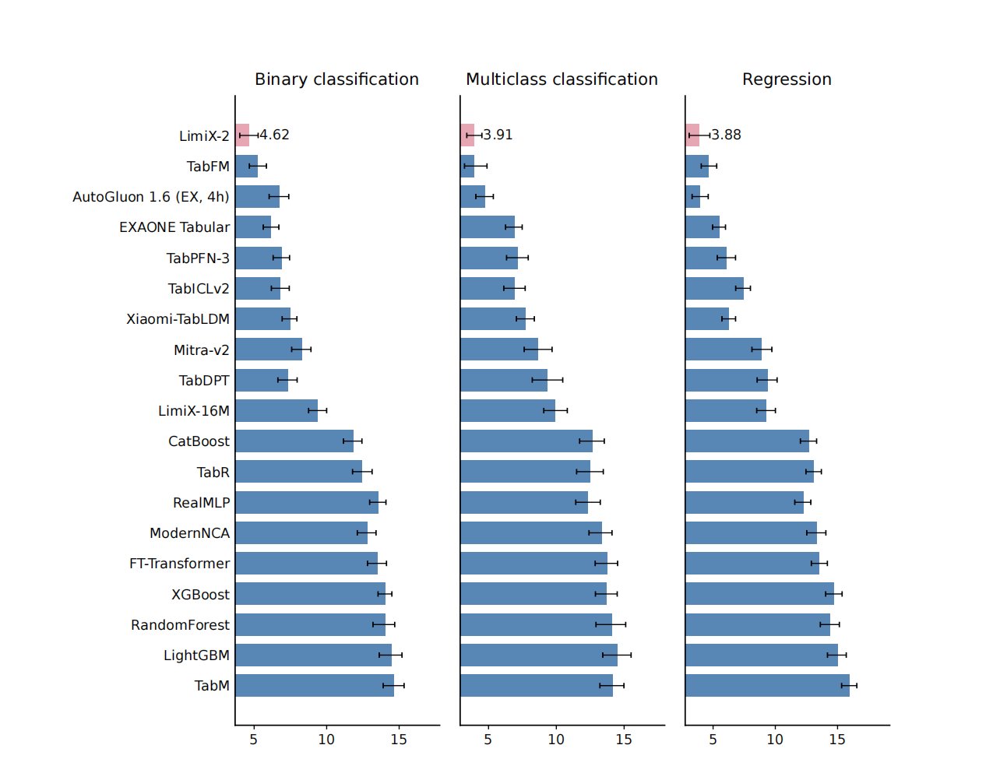
  <br>
  <sub>Average-rank comparison on the TALENT benchmark. LimiX-2 attains the lowest average rank on binary classification, multiclass classification, and regression (4.62, 3.91, and 3.88).</sub>
</div>

<div align="center">
  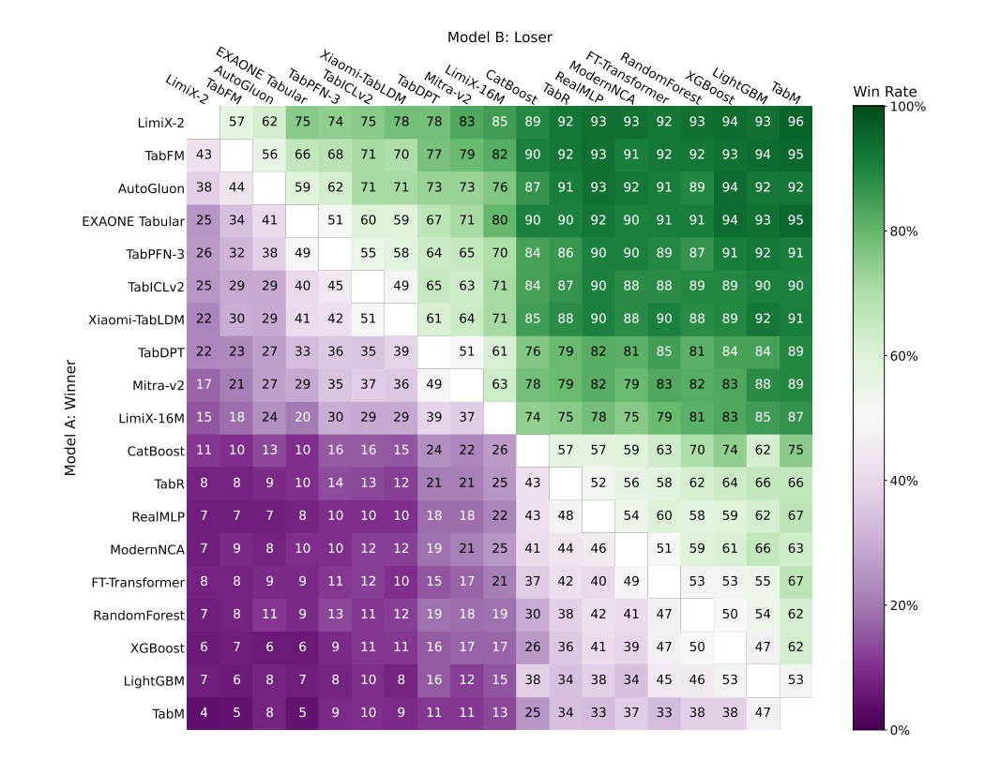
  <br>
  <sub>Pairwise win rates on the TALENT benchmark.</sub>
</div>

### ➩ BCCO

On BCCO, LimiX-2 ranks first overall with an Elo of **1432** (56 / 63 / 202 points above AutoGluon 1.6 (EX, 4h), TabFM, and LimiX-16M), an improvability of **6.97%**, and an aggregated win count of **50.4** (≈3.0× TabFM).

<div align="center">

| Model | Elo | CLS | REG | Binary | Multi | Improv. ↓ | Wins ↑ |
| --- | --- | --- | --- | --- | --- | --- | --- |
| **LimiX-2** | **1432** | **1321** | **1859** | **1284** | 1414 | **6.97%** | **50.4** |
| AutoGluon 1.6 | 1376 | 1269 | 1782 | 1199 | **1443** | 9.77% | 24.5 |
| TabFM | 1369 | 1260 | 1785 | 1213 | 1374 | 12.24% | 16.7 |
| EXAONE Tabular | 1345 | 1255 | 1689 | 1224 | 1333 | 13.40% | 7.8 |
| TabPFN-3 | 1295 | 1188 | 1691 | 1153 | 1275 | 14.92% | 5.7 |
| LimiX-16M | 1230 | 1195 | 1385 | 1173 | 1252 | 16.94% | 6.1 |
| CatBoost | 1140 | 1101 | 1287 | 1096 | 1118 | 21.64% | 4.6 |
| RandomForest | 1000 | 1000 | 1000 | 1000 | 1000 | 26.75% | 2.3 |

</div>

<div align="center">
  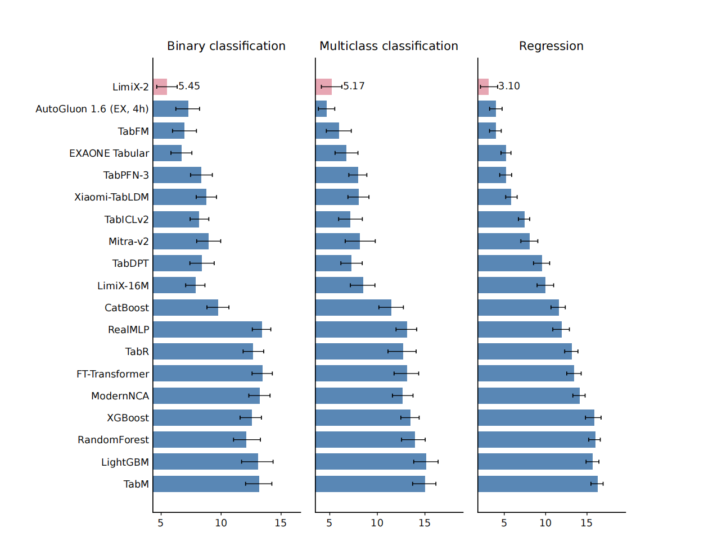
  <br>
  <sub>Average-rank comparison on the BCCO benchmark. LimiX-2 attains the lowest average rank on binary classification, multiclass classification, and regression.</sub>
</div>

<div align="center">
  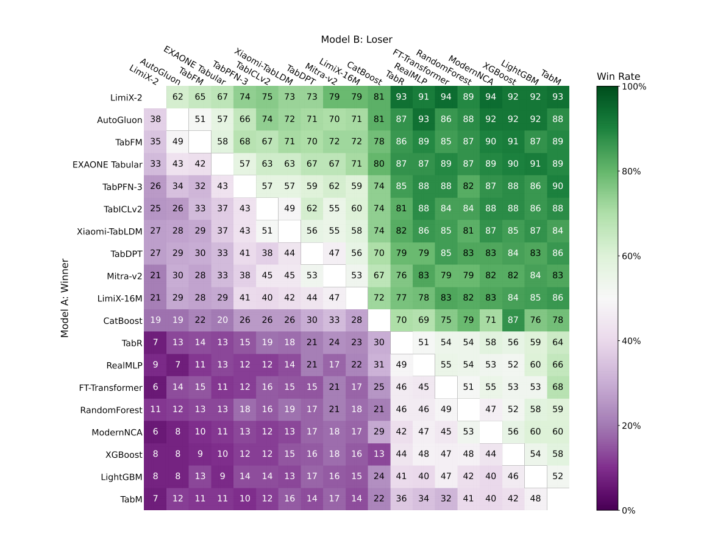
  <br>
  <sub>Pairwise win rates on the BCCO benchmark.</sub>
</div>

### ➩ Scaling Law

The scaling study evaluates LimiX-2 configurations ranging from 12.5M to 406.2M parameters and extrapolates the fitted log-linear trend toward the billion-parameter regime. Across all five evaluation series, downstream performance follows a clear log-linear trend with model size.

<div align="center">

| Evaluation Task | α (Elo @100M) | β (Elo / doubling) | R² | RMSE |
| --- | --- | --- | --- | --- |
| TabArena | 1863.88 | 34.68 | 0.9808 | 8.31 |
| TALENT classification | 1427.25 | 22.16 | 0.9792 | 5.53 |
| TALENT regression | 1545.12 | 18.26 | 0.9680 | 5.69 |
| BCCO classification | 1295.86 | 11.24 | 0.9617 | 3.84 |
| BCCO regression | 1795.89 | 30.06 | 0.9702 | 9.03 |

</div>

<div align="center">
  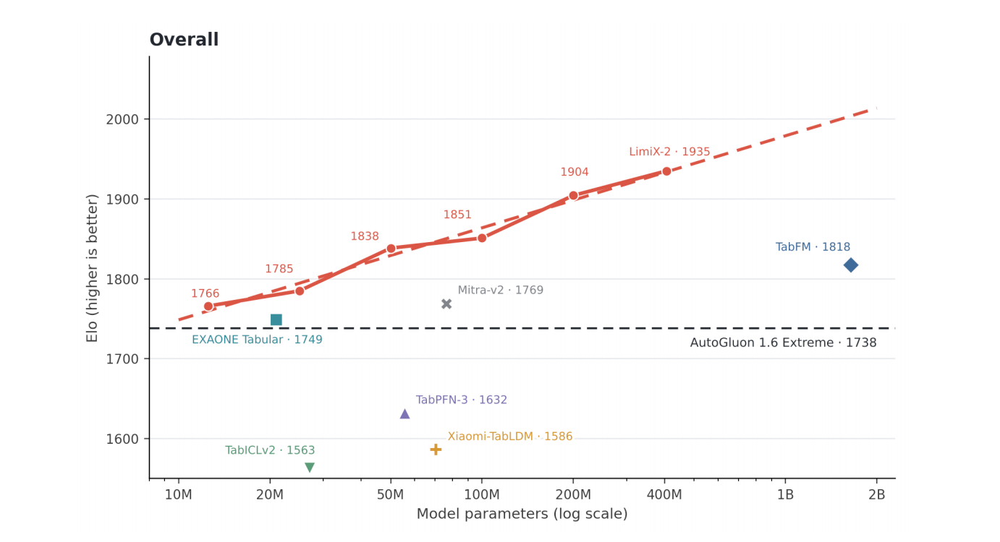
  <br>
  <sub>Parameter scaling on TabArena. The solid line connects the observed LimiX-2 scale points, while the dashed line shows the log-linear fit extrapolated to 2B parameters.</sub>
</div>

<div align="center">
  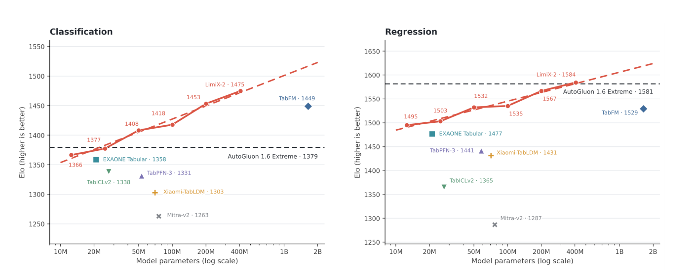
  <br>
  <sub>Parameter scaling on TALENT classification and regression.</sub>
</div>

<div align="center">
  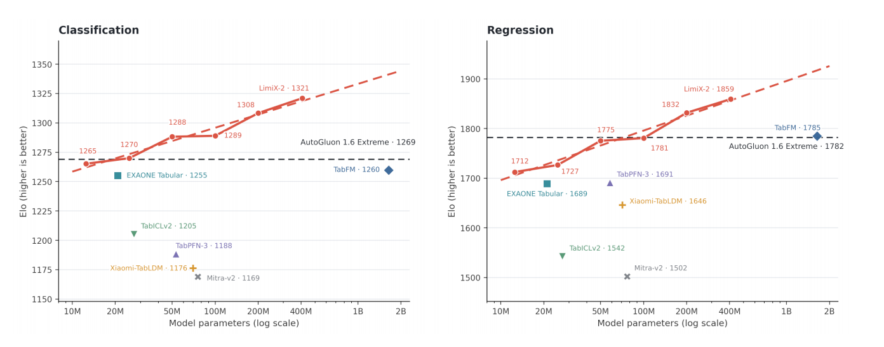
  <br>
  <sub>Parameter scaling on BCCO classification and regression.</sub>
</div>

## ➤ Tutorials

### ➩ Installation

Python >= 3.12 is required. Other Python dependencies are installed by `pip install -e .` (including `torch==2.9.1`). `torch` / `flash-attn` must match your local CUDA; you can install them in Step 1 (optional).

#### Step 1 (optional): Install PyTorch and flash-attn

Recommended versions (see `constraints.txt`): `torch==2.9.1`, `torchvision==0.24.1`, `torchaudio==2.9.1`. Install a CUDA-matched build from [pytorch.org](https://pytorch.org), for example:

```bash
pip install torch==2.9.1 torchvision==0.24.1 torchaudio==2.9.1
```

Then download a prebuilt wheel from [flash-attention Releases](https://github.com/Dao-AILab/flash-attention/releases) that matches your Python / CUDA / torch versions (it must align with torch 2.9.1 above; the filename below is illustrative):

```bash
wget -O flash_attn.whl https://github.com/Dao-AILab/flash-attention/releases/download/v2.8.1/flash_attn-2.8.1+cu12torch2.9cxx11abiTRUE-cp312-cp312-linux_x86_64.whl
pip install flash_attn.whl
```

#### Step 2: pip editable install

```bash
git clone https://github.com/limix-ldm-ai/LimiX.git
cd LimiX
python -m pip install -e .
```

This installs `LimiX-infer` and makes `from inference.predictor import LimiXPredictor` / `from limix import LimiXPredictor` work from any working directory. If `torch==2.9.1` was already installed in Step 1, that build is reused.

## ➤ Inference

LimiX supports classification, regression, and missing-value imputation. The public entry point is `inference.predictor.LimiXPredictor`, which routes to `v1_0` / `v2_0` from the checkpoint architecture version. Use a config that matches the model (LimiX-2 / V2.0 uses `*_v2.json`).

### ➩ Command-line: `LimiX-infer`

After `pip install -e .`, `LimiX-infer` is the same entry as `python infer.py`. Required flags: `--task_type`, `--data_dir`, `--model_path`. If `--inference_config_path` is omitted, a packaged default config is chosen from the task and checkpoint version (`*_v2.json` for V2.0).

`--data_dir` is a benchmark root: one subdirectory per dataset. See the public [bcco_cls](https://huggingface.co/datasets/stable-ai/bcco_cls) / [bcco_reg](https://huggingface.co/datasets/stable-ai/bcco_reg) layout. Subdirectories without the required CSVs are skipped.

```
<data_dir>/
  <dataset_name>/
    <dataset_name>_train.csv
    <dataset_name>_test.csv
    <dataset_name>_0.05.csv    # Feature_imputation only; suffix follows --mask_ratio (default 0.05)
```

Each CSV has a header. The last column is the target (`label` on classification sets; the regression target value on regression sets); all other columns are features.

```bash
LimiX-infer --help
```

Classification / regression / missing-value imputation:

```bash
LimiX-infer --task_type Classification --data_dir /path/to/class202512_527 --model_path /path/to/LimiX-2.ckpt --gpuid 0 --save_name limix_cls
LimiX-infer --task_type Regression --data_dir /path/to/reg202512_288 --model_path /path/to/LimiX-2.ckpt --gpuid 0 --save_name limix_reg
LimiX-infer --task_type Feature_imputation --data_dir /path/to/mvi_data --model_path /path/to/LimiX-2.ckpt --gpuid 0 --save_name limix_mvi
```

`--task_type` also accepts aliases `cls` / `reg` / `imputation`. Common optional flags:

<div align="center">

| Flag | Description |
| ------------------------- | --------------------------------------------------------------------- |
| `--inference_config_path` | JSON config path (packaged default if omitted) |
| `--save_name` | Result directory name |
| `--device` | `cuda` (default) or `cpu` |
| `--gpuid` | GPU id(s), default `0`; ignored when `--device cpu` |
| `--gpu_num_per_predictor` | GPUs per predictor (V2.0 only) |
| `--autobatch` | Enable autobatch |
| `--show_progress` | Show progress |
| `--seed` | Random seed |

</div>

### ➩ Interface description

#### Model Creation

```python
from inference.predictor import LimiXPredictor

class LimiXPredictor:
    def __init__(self,
                 device: torch.device,
                 model_path: str,
                 inference_config: dict | list | str,
                 mix_precision: bool = True,
                 outlier_remove_std: float = 12,
                 softmax_temperature: float = 0.9,
                 average_before_softmax: bool = True,
                 categorical_features_indices: List[int] | None = None,
                 inference_with_DDP: bool = False,
                 use_data_cache: bool = False,
                 seed: int = 0)
```

<div align="center">

| Parameter | Data Type | Description |
| ---------------------------- | ----------------- | -------------------------------------------------------------------------------- |
| device | torch.device | Inference device; `cuda` recommended |
| model_path | str | Path to the checkpoint |
| inference_config | dict / list / str | Inference config (dict / list / JSON path) |
| mix_precision | bool | Whether to use mixed precision |
| outlier_remove_std | float | Std-dev multiplier for outlier clipping |
| softmax_temperature | float | Temperature for the softmax operator; must be > 0 |
| average_before_softmax | bool | Bucket regression: average before softmax |
| categorical_features_indices | list | Indices of categorical columns |
| inference_with_DDP | bool | Whether to enable DDP (keep False on V2.0) |
| use_data_cache | bool | Whether to cache preprocessing results |
| seed | int | Seed for random states |

</div>

#### Predict

```python
def predict(self,
            x_train: np.ndarray,
            y_train: np.ndarray,
            x_test: np.ndarray,
            task_type: Literal["Classification", "Regression", "Feature_imputation"] = "Classification",
            unique_dataset_name: str | None = None) -> np.ndarray:
```

<div align="center">

| Parameter | Data Type | Description |
| ------------------- | ---------- | -------------------------------------------------------------------------------- |
| x_train | np.ndarray | Training features, shape `(n_train, n_features)` |
| y_train | np.ndarray | Training targets, shape `(n_train,)` |
| x_test | np.ndarray | Query features; columns must align with `x_train` |
| task_type | str | `"Classification"` (default), `"Regression"`, or `"Feature_imputation"` |
| unique_dataset_name | str | Optional dataset id for the preprocess cache |

</div>

Return value:

- Classification: class probabilities of shape `(n_query, n_classes)`; rows sum to 1
- Regression: predictions of shape `(n_query,)` (V2.0 returns the original target scale; no manual denormalization)
- Missing-value imputation: the imputed feature matrix

### ➩ Inference configuration files

<div align="center">

| Configuration File Name | Models | Description |
| ----------------------------------- | -------------------- | ----------------------------------------------------- |
| cls_default_noretrieval_v2.json | LimiX-2 / V2.0 | Default **classification** (no retrieval) |
| reg_default_noretrieval_v2.json | LimiX-2 / V2.0 | Default **regression** (no retrieval) |
| reg_default_noretrieval_MVI_v2.json | LimiX-2 / V2.0 | Default **missing-value imputation** |
| cls_default_retrieval.json | LimiX-16M / LimiX-2M | Classification + retrieval; better accuracy |
| cls_default_noretrieval.json | LimiX-16M / LimiX-2M | Classification, no retrieval; faster |
| reg_default_retrieval.json | LimiX-16M / LimiX-2M | Regression + retrieval; better accuracy |
| reg_default_noretrieval.json | LimiX-16M / LimiX-2M | Regression, no retrieval; faster |
| reg_default_noretrieval_MVI.json | LimiX-16M / LimiX-2M | Missing-value imputation |

</div>

### ➩ Classification

```python
from sklearn.datasets import load_breast_cancer
from sklearn.metrics import accuracy_score, roc_auc_score
from sklearn.model_selection import train_test_split
from huggingface_hub import hf_hub_download
import numpy as np
import os, sys
import torch

os.environ["RANK"] = "0"
os.environ["WORLD_SIZE"] = "1"
os.environ["MASTER_ADDR"] = "127.0.0.1"
os.environ["MASTER_PORT"] = "29500"

ROOT_DIR = os.path.abspath(os.path.join(os.path.dirname(__file__), ".."))
if ROOT_DIR not in sys.path:
    sys.path.insert(0, ROOT_DIR)
from inference.predictor import LimiXPredictor

X, y = load_breast_cancer(return_X_y=True)
X_train, X_test, y_train, y_test = train_test_split(X, y, test_size=0.5, random_state=42)

model_file = hf_hub_download(repo_id="stable-ai/LimiX-2", filename="LimiX-2.ckpt", local_dir="./cache")

clf = LimiXPredictor(
    device=torch.device("cuda"),
    model_path=model_file,
    inference_config=os.path.join(ROOT_DIR, "config", "cls_default_noretrieval_v2.json"),
)
prediction = clf.predict(X_train, y_train, X_test, task_type="Classification")

print("roc_auc_score:", roc_auc_score(y_test, prediction[:, 1]))
print("accuracy_score:", accuracy_score(y_test, np.argmax(prediction, axis=1)))
```

For the full example, see [examples/demo_classification.py](./examples/demo_classification.py)

### ➩ Regression

```python
from functools import partial

from sklearn.datasets import load_diabetes
from sklearn.model_selection import train_test_split
from sklearn.metrics import r2_score
from huggingface_hub import hf_hub_download
import torch

try:
    from sklearn.metrics import root_mean_squared_error as mean_squared_error
except:
    from sklearn.metrics import mean_squared_error
    mean_squared_error = partial(mean_squared_error, squared=False)
import os, sys

os.environ["RANK"] = "0"
os.environ["WORLD_SIZE"] = "1"
os.environ["MASTER_ADDR"] = "127.0.0.1"
os.environ["MASTER_PORT"] = "29500"

ROOT_DIR = os.path.abspath(os.path.join(os.path.dirname(__file__), ".."))
if ROOT_DIR not in sys.path:
    sys.path.insert(0, ROOT_DIR)
from inference.predictor import LimiXPredictor

X, y = load_diabetes(return_X_y=True)
X_train, X_test, y_train, y_test = train_test_split(X, y, test_size=0.33, random_state=42)

model_path = hf_hub_download(repo_id="stable-ai/LimiX-2", filename="LimiX-2.ckpt", local_dir="./cache")

model = LimiXPredictor(
    device=torch.device("cuda"),
    model_path=model_path,
    inference_config=os.path.join(ROOT_DIR, "config", "reg_default_noretrieval_v2.json"),
)
y_pred = model.predict(X_train, y_train, X_test, task_type="Regression")

rmse = mean_squared_error(y_test, y_pred)
r2 = r2_score(y_test, y_pred)

print(f"RMSE: {rmse}")
print(f"R2: {r2}")
```

For the full example, see [examples/demo_regression.py](./examples/demo_regression.py)

### ➩ Missing value imputation

```python
model = LimiXPredictor(
    device=torch.device("cuda"),
    model_path=model_path,
    inference_config=os.path.join(ROOT_DIR, "config", "reg_default_noretrieval_MVI_v2.json"),
)
reconstructed_X = model.predict(X_train, y_train, x_test_with_nan, task_type="Feature_imputation")
```

For the full example, see [examples/demo_missing_value_imputation.py](./examples/demo_missing_value_imputation.py)

## ➤ Link

- LimiX:Unleashing Structured-Data Modeling Capability for Generalist Intelligence: [Arxiv](https://arxiv.org/abs/2509.03505)
- LimiX Technical Report: [LimiX_Technical_Report.pdf](https://github.com/limix-ldm/LimiX/blob/main/LimiX_Technical_Report.pdf)
- LimiX-2 Technical Report: [LimiX_2_Technical_Report.pdf](./LimiX_2_Technical_Report.pdf)
- Detailed instructions for using Limix: [Visit the official Limix documentation](https://www.limix.ai/doc/)
- Balance Comprehensive Challenging Omni-domain Classification Benchmark: [BCCO-cls](https://huggingface.co/datasets/stable-ai/bcco_cls)
- Balance Comprehensive Challenging Omni-domain Regression Benchmark: [BCCO-reg](https://huggingface.co/datasets/stable-ai/bcco_reg)

## 📃 License

The code in this repository is licensed under the [Stable AI Technology Co., Ltd. License, Version 1.0 (September 2026)](./LICENSE.txt), which is **derived from the Apache License, Version 2.0**: Sections 1–9 reproduce the terms and conditions of Apache 2.0, with the definition of "License" in Section 1 modified solely to incorporate the additional provisions of Section 10 (**Additional Attribution and Model Naming Requirements**). Third-party code is subject to its own licenses and attribution requirements; see [LICENSE.txt](./LICENSE.txt). Model weights are licensed separately:

- LimiX-2: [StableAI LimiX Non-Commercial License](https://huggingface.co/stableai-org/LimiX-2/blob/main/LICENSE)
- LimiX-2M: [Stable AI Technology Co., Ltd. License](https://huggingface.co/stableai-org/LimiX-2M/blob/main/LICENSE.txt)
- LimiX-16M: [Stable AI Technology Co., Ltd. License](https://huggingface.co/stableai-org/LimiX-16M/blob/main/LICENSE.txt)
- LimiX-1-2M: [Stable AI Technology Co., Ltd. License](https://huggingface.co/stableai-org/LimiX-1_2M/blob/main/LICENSE)
- LimiX-1-16M: [Stable AI Technology Co., Ltd. License](https://huggingface.co/stableai-org/LimiX-1_16M/blob/main/LICENSE)

## 📝 Citation
```
@article{zhang2025limix,
  title={Limix: Unleashing structured-data modeling capability for generalist intelligence},
  author={Zhang, Xingxuan and Ren, Gang and Yu, Han and Yuan, Hao and Wang, Hui and Li, Jiansheng and Wu, Jiayun and Mo, Lang and Mao, Li and Hao, Mingchao and others},
  journal={arXiv preprint arXiv:2509.03505},
  year={2025}
}
```
